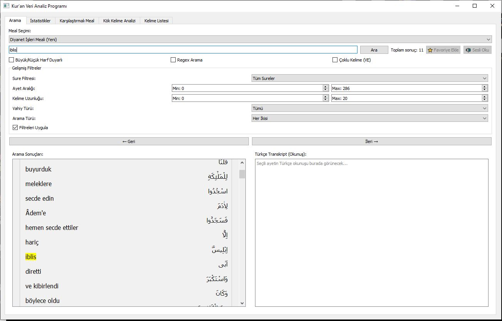
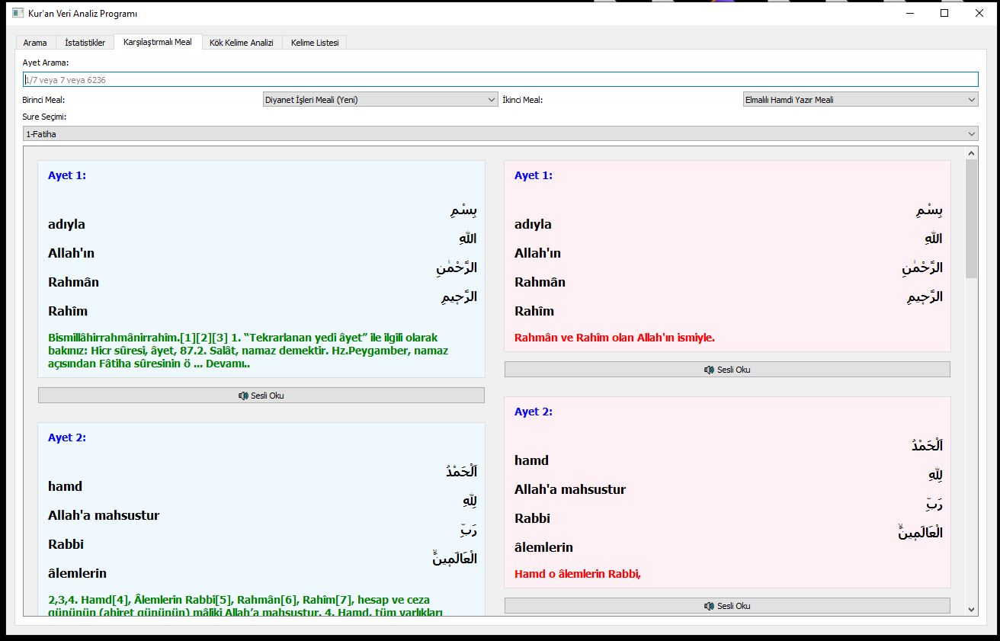
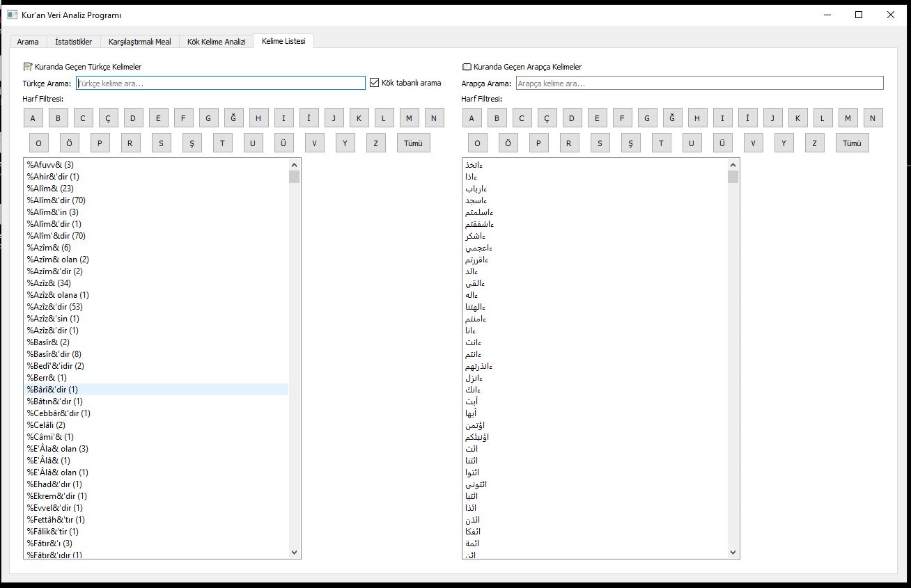

# 🕌 Kuran Veri Analizi

Bu proje, **Python** kullanılarak Kuran metinlerinin analizi, arama ve sesli okuma işlevlerini bir araya getirir.  
Amaç, veritabanı tabanlı bir yapı ile Kuran kelimelerini, anlamlarını ve ilişkili verileri etkileşimli biçimde incelemektir.

---

## 🚀 Özellikler
- Arama ve filtreleme
- Kelime-temelli analiz
- Türkçe mealli veri tabanı
- Sesli okuma (TTS)
- Görsel arayüz (arayüz1–3)

---

## 📂 Dosya Yapısı
images/ → Arayüz görselleri
veriler/ → JSON ve SQL veri dosyaları
main.py → Ana çalışma dosyası
utils/ → Yardımcı Python modülleri

---

## 📸 Arayüz Görselleri

---

## Katkı
Katkıda bulunmak için pull request gönderebilirsiniz.

## Lisans
Bu proje açık kaynaklıdır.
